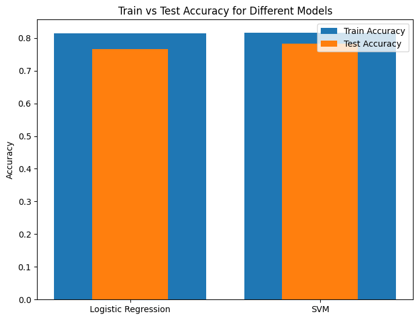
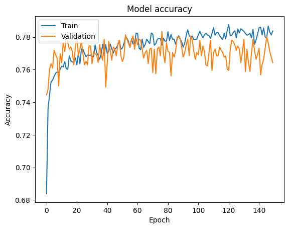
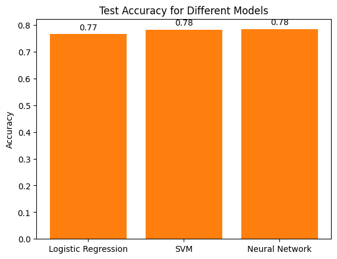

## Airline Sentiment Analysis using BERT and Machine Learning
### Introduction

The Project is about Sentiment Analysis of Airline Tweets using BERT and Machine Learning. 

### Dataset

The dataset is taken from Kaggle. The dataset contains 14640 tweets with 15 columns. The main columns are as follows:

1. `airline_sentiment`: It contains the ground truth sentiment of the tweet. It can be positive, negative or neutral.
2. `airline`: It contains the name of the airline.
3. `retweet_count`: It contains the number of retweets.
4. `text`: It contains the text of the tweet.

### Data Preprocessing

The data preprocessing is done using the following steps:

1. The columns which are not required are dropped.
2. The tweets are cleaned using the following steps:
    1. The tweets are converted to lowercase.
    2. The tweets are tokenized.
    3. The stopwords are removed.
    4. The tweets are lemmatized.
    5. The tweets are joined back to form a sentence.
3. The text embeddings are generated using the BERT model.
4. The text embeddings are used to train the machine learning models.

### Machine Learning Models

The following machine learning models are used:

1. Logistic Regression
2. Support Vector Machine
3. Convolutional Neural Network

### Results

The following results are obtained:

| Model | Accuracy |
| --- | --- |
| Logistic Regression | 0.77 |
| Support Vector Machine | 0.78 |
| Convolutional Neural Network | 0.78 |

### Comparison of the Trains vs Test Accuracy of Logistic Regression and Support Vector Machine

### Comparison of the Trains vs Test Accuracy of Convolutional Neural Network

### Comparison of the performance of the Logistic Regression and Support Vector Machine and Convolutional Neural Network

### Conclusion

The results show that the machine learning models are able to predict the sentiment of the tweets with an accuracy of 78%. The results can be improved by using more data and by using more complex models.

### References

1. https://www.kaggle.com/crowdflower/twitter-airline-sentiment

